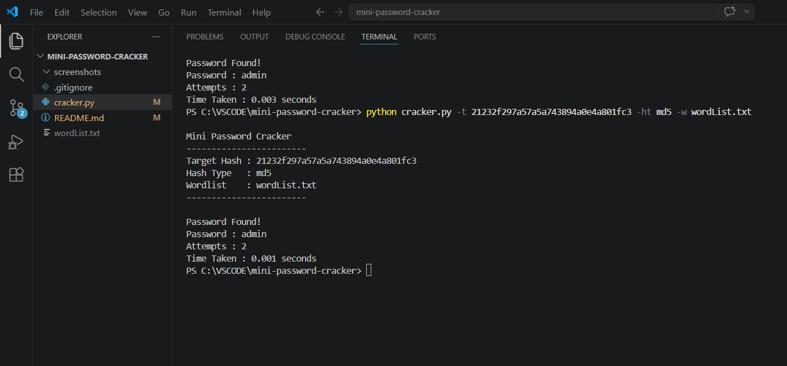
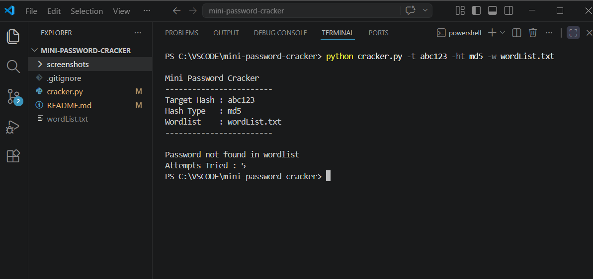

# Mini Password Cracker

This is a small Python project I made while learning basic offensive cybersecurity concepts.  
The idea was to understand how a dictionary attack works by trying to crack hashed passwords using a wordlist.

Instead of using tools like Hashcat directly, I wanted to first build a simple version myself and understand what happens behind the scenes.

## Why I made this
I built this mainly for practice and learning.

Things I wanted to understand:
- How password hashes are compared
- How dictionary attacks work
- Why weak passwords are dangerous
- How to make a simple command-line security tool in Python

## What it does
Currently the script can:

- Crack MD5 and SHA256 hashes
- Use a custom wordlist file
- Count attempts
- Show time taken
- Take inputs using command-line arguments

## Run the tool

```bash
python cracker.py -t <hash> -ht md5 -w wordList.txt
```

Example:

```bash
python cracker.py -t 21232f297a57a5a743894a0e4a801fc3 -ht md5 -w wordList.txt
```

## Sample output

```text
Mini Password Cracker

Target Hash : 21232f297a57a5a743894a0e4a801fc3

[+] Password Found
Password : admin
Attempts : 3
Time Taken : 0.001 seconds
```

## Screenshots

Successful crack:





## Files
```text
cracker.py
README.md
wordlists/
screenshots/
```

## What I learned from building this
This project helped me understand the logic behind password cracking instead of treating it like a black box.

I also got practice with:
- Python scripting
- hashlib
- argparse
- Working with wordlists
- Basic cybersecurity concepts

## Things I want to improve later
Some upgrades I may add:

- Multithreading
- Larger wordlists
- Rule-based mutations
- Better terminal output
- Support for more hash types

## Note
This project was made only for educational purposes and testing in authorized environments.